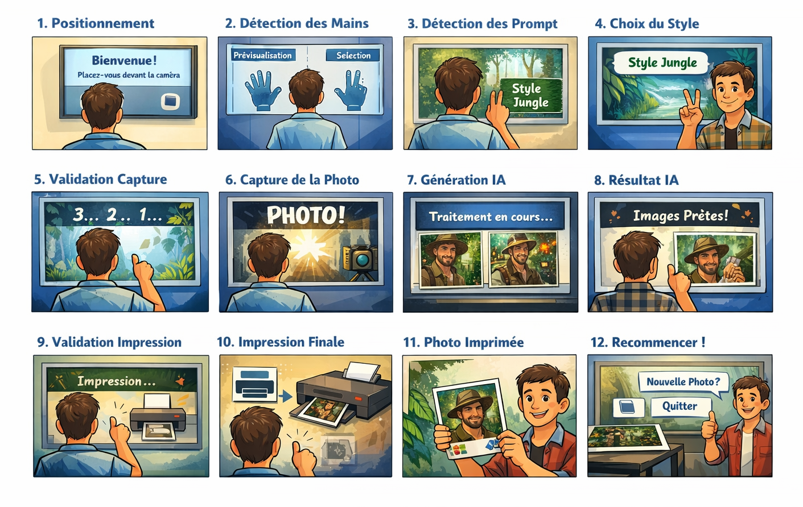
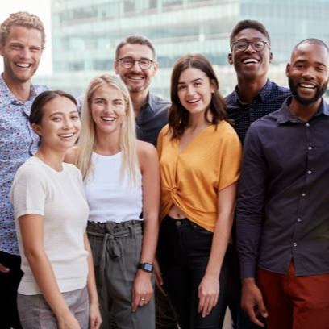
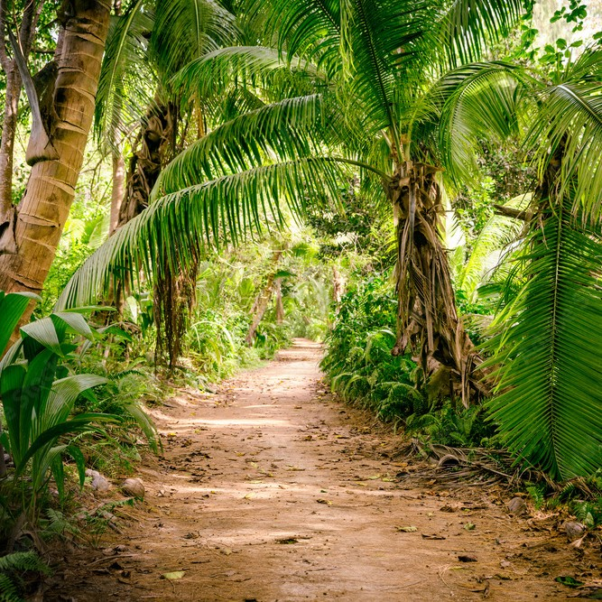
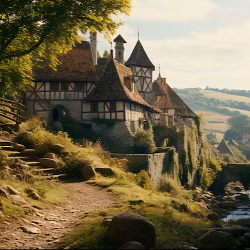
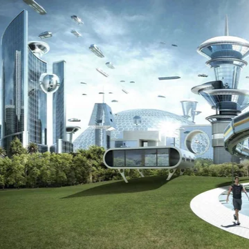
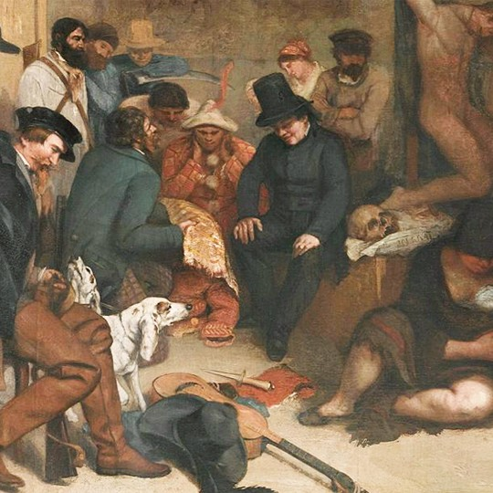

# Photo Booth IA – MDM 2025
Lien vers le REPO : *https://github.com/yanisDrx/photobooth_ia-main/tree/features*

Photobooth intelligent combinant vision par ordinateur, interaction gestuelle et génération d’images via Stable Diffusion XL.

Ce projet propose une expérience immersive où l’utilisateur interagit uniquement avec ses mains pour choisir un univers visuel, capturer une photo et générer une version stylisée par IA, prête à être imprimée.

Ce projet s’inspire et se base sur le photobooth créé par Fabrice JUMEL. Seul le README à été modifié afin d'y ajouter des modifications potentielles. L'ancien README correspondant au code python et aux autres fichiers n'est autre que le fichier OLD_README que l'on peut trouver dans ce même dossier.
---

# Sommaire

- [1. Présentation du projet](#1-présentation-du-projet)
- [2. Storyboard utilisateur (expérience complète)](#2-storyboard-utilisateur-expérience-complète)
- [3. Fonctionnement général du système](#3-fonctionnement-général-du-système)
- [4. Profils de filtres & prompts](#5-profils-de-filtres--prompts)
- [5. Architecture technique et dépendances logicielles](#6-architecture-technique-et-dépendances-logicielles)
- [6. Prérequis matériel](#7-prérequis-matériel)
- [7. Recherche & choix de conception](#9-recherche--choix-de-conception)
- [8. Pistes d’amélioration](#10-pistes-damélioration)

---

# 1. Présentation du projet

Ce projet implémente un photobooth interactif basé sur :

- 📸 Capture webcam en temps réel
- 🖐️ Détection et reconnaissance de gestes
- 🎨 Prévisualisation instantanée de styles (filtres temps réel)
- 🤖 Génération d’image via **Stable Diffusion XL + ControlNet OpenPose**
- 🖼️ Ajout automatique d’un logo
- 🖨️ Impression physique au format A6 glacé

L’utilisateur n’utilise **ni souris ni écran tactile** : tout se fait par gestes.

L’objectif est de créer une expérience fluide, intuitive et immersive.

---

# 2. Timeline utilisateur + Storyboard (expérience complète)

## Timeline :

### Étape 1 — Positionnement
L’utilisateur se place devant la webcam.

### Étape 2 — Prévisualisation (main gauche)

Il lève des doigts avec la **main gauche** pour tester différents styles.

 -> Cette action applique uniquement un filtre local (preview).
 -> Aucun prompt n’est encore envoyé à l’IA.

### Étape 3 — Sélection du style (main droite)

Il reproduit le même nombre de doigts avec la **main droite**.

 -> Cette action sélectionne officiellement le profil.
 -> Le prompt correspondant est chargé et sera transmis à l’IA lors de la génération.
 -> Un message de confirmation du choix du profil est affiché sur l'écran

### Étape 4 — Génération IA

Le système envoie à Stable Diffusion :

- l’image originale
- le prompt sélectionné via la main droite

L’IA applique le style choisi.

### Étape 5 — Capture  

Il déclenche la capture avec 👍 pouce gauche.

 -> L'utilisateur doit garder son pouce levé 2 secondes pour confirmer la capture.
 -> Un chargement indiquant la progression sur l'écoulement du cooldown s'affiche.
 -> Une fois le cooldown terminé, un message de confirmation s'affiche.
 -> L’image générée par IA est enregistrée.
 
### Étape 6 — Impression

Validation avec 👍 pouce droit.

 -> L'utilisateur doit garder son pouce levé 2 secondes pour confirmer l'impression.
 -> Un chargement indiquant la progression sur l'écoulement du cooldown s'affiche.
 -> Une fois le cooldown terminé, un message de confirmation s'affiche.
 -> L’image générée est imprimée.

## Storyboard :



---

# 3. Fonctionnement général du système

| Main | Rôle |
|------|------|
| ✋ Main gauche | Prévisualisation des filtres + Capture |
| 🤚 Main droite | Sélection du prompt + Impression |

## Principes clés

- La **prévisualisation** n’affecte jamais l’image (le prompt) envoyée à l’IA.
- La **main droite détermine le prompt réel** envoyé à Stable Diffusion.
- Les gestes système (capture / impression) sont isolés pour éviter tout conflit.

## Règles de gestuelle

- Le pouce n’est **jamais utilisé pour choisir un profil**
- Les profils commencent à partir de l’index levé
- Un poing fermé = état neutre
- Le nombre de doigts levés = numéro du profil

---

# 4. Profils de filtres & prompts

## Tableau récapitulatif

| Geste | Profil | Image |
|-------|--------|-------|
| ✊ Poing fermé | Default |  |
| ☝ 1 doigt | Futuriste cartoon |  |
| ✌ 2 doigts | Médiéval |  |
| 🤟 3 doigts | Naturel / Jungle |  |
| 🖖 4 doigts | Artistique / Peinture |  |

## Prompts de Profils

**Profil 1 : Médiéval**
```python
PROMPT_MEDIEVAL = (
    "medieval fantasy illustration, cinematic lighting, ultra detailed, realistic textures, "
    "knight armor with engraved steel, leather straps, medieval tunic, "
    "(stone castle background:1.3), (torch light atmosphere:1.2), warm fire glow, "
    "(dramatic volumetric lighting:1.2), epic fantasy mood, "
    "high detail fabric texture, 14th century aesthetic, "
    "sharp focus, 4k, professional fantasy artwork"
)

NEGATIVE_PROMPT_MEDIEVAL = (
    "modern clothes, futuristic objects, neon lights, cyberpunk, low quality, blurry, "
    "extra fingers, extra limbs, deformed hands, bad anatomy"
)

```

**Profil 2 : Jungle**
```python
PROMPT_JUNGLE = (
    "tropical jungle portrait, cinematic natural lighting, ultra realistic, "
    "(lush green foliage:1.3), (hanging vines:1.2), dense rainforest background, "
    "sunlight rays through trees, humid atmosphere, "
    "(leaf crown and natural elements integrated into clothing:1.2), "
    "earth tones color palette, shallow depth of field, "
    "high detail skin texture, photorealistic, 4k photography"
)

NEGATIVE_PROMPT_JUNGLE = (
    "urban background, buildings, modern objects, cold lighting, cyberpunk, "
    "low resolution, blurry, extra fingers, extra limbs, bad anatomy"
)
```

**Profil 3 : Futuriste**
```python
PROMPT_FUTURISTIC = (
    "futuristic sci-fi portrait, cinematic lighting, ultra detailed, "
    "(holographic interface around subject:1.3), (floating transparent screens:1.2), "
    "cyberpunk city background, neon cyan and magenta glow, "
    "(advanced wearable technology:1.2), glowing circuits on clothes, "
    "high contrast lighting, reflective glass surfaces, "
    "professional sci-fi photography, 4k, sharp focus"
)

NEGATIVE_PROMPT_FUTURISTIC = (
    "medieval objects, nature forest, warm lighting, low detail, blurry, "
    "extra fingers, extra limbs, deformed anatomy"
)
```

**Profil 4 : Peinture**
```python
PROMPT_ARTISTIC = (
    "oil painting portrait, renaissance inspired, dramatic chiaroscuro lighting, "
    "(visible brush strokes:1.3), textured canvas effect, "
    "warm golden highlights, deep shadows, "
    "classical fine art composition, museum quality painting, "
    "high detail face, realistic proportions, "
    "8k resolution, masterpiece"
)

NEGATIVE_PROMPT_ARTISTIC = (
    "photography, modern background, flat lighting, low quality, "
    "extra fingers, extra limbs, bad anatomy"
)
```

---

# 5. Architecture technique et dépendances logicielles

## Pipeline simplifié

1. Capture image via OpenCV
2. Détection des mains via MediaPipe
3. Comptage/Reconnaissance des doigts
4. Détermination du profil
5. Capture image originale
6. Encodage base64
7. Envoi à Stable Diffusion WebUI
8. Réception image stylisée
9. Capture et/ou impression de l'image générée

## Dépendances Logicielles

### Stable Diffusion WebUI

- PyTorch 2.5.1 + CUDA 12.1
- xFormers 0.0.23
- Diffusers 0.31.0
- ControlNet Aux 0.0.10
- MediaPipe 0.10.21
- ONNX Runtime GPU 1.17.1

### Photo Booth

- OpenCV 4.11.0
- MediaPipe 0.10.21
- NumPy 1.26.2
- Requests 2.32.5
- Python 3.10.x

---

# 6. Prérequis matériel

| Composant | Spécification |
|-----------|--------------|
| GPU | NVIDIA RTX 2060+ recommandé |
| RAM | 16GB minimum (32GB recommandé) |
| Webcam | 720p minimum |
| Écran | 3840x1080 recommandé |
| Imprimante | HP Color LaserJet 5700 |

---

# 7. Recherche & choix de conception

## Conflit avec Symbole V

Servait à capturer.
Conflit avec Profil 2.
Solution :

- Capture = 👍 gauche
- Impression = 👍 droite

Interaction claire et intuitive.

---

# 10. Etapes d’amélioration / Implémentation détaillée

Cette section décrit comment, à partir du code existant, le projet peut être étendu et structuré pour atteindre l’objectif final défini dans le README. Chaque étape précise les ajouts ou modifications nécessaires, avec le code associé lorsque possible.

---

## Étape 1 — Gestion des imports et configuration initiale

Les imports et constantes sont **largement conservés**. Les modifications mineures concernent :

- Ajout des prompts par profil
- Paramètres généraux pour Stable Diffusion et MediaPipe
- Gestion du logo et des écrans

```python
# Les imports restent les mêmes
import cv2
import os
import time
import base64
import subprocess
from datetime import datetime
import requests
import numpy as np
import mediapipe as mp
import sys
import argparse

# Paramètres caméra et Stable Diffusion
CAMERA_WIDTH, CAMERA_HEIGHT = 1280, 720
WIDTH, HEIGHT = 1280, 720
DENOISING_STRENGTH = 0.62
CFG_SCALE = 7.5
...

```
## Étape 2 — Détection des gestes

Le code de détection des gestes reste inchangé, mais il est crucial d'ajouter :
Distinction entre main gauche (prévisualisation) et main droite (validation prompt)

## Étape 3 — Prévisualisation (main gauche)

Le nombre de doigts levés sur la main gauche déclenche uniquement la prévisualisation :
Appliquer localement un filtre correspondant au profil
Ne pas envoyer le prompt à Stable Diffusion

```py
def apply_preview(frame, fingers_count_left):
    """Applique un filtre local selon la main gauche"""
    if fingers_count_left == 1:
        preview_img = apply_medieval_filter(frame)
    elif fingers_count_left == 2:
        preview_img = apply_jungle_filter(frame)
    elif fingers_count_left == 3:
        preview_img = apply_futuristic_filter(frame)
    elif fingers_count_left == 4:
        preview_img = apply_artistic_filter(frame)
    else:
        preview_img = frame  # Poing fermé
    return preview_img

```

## Étape 4 — Sélection du prompt (main droite)

Le nombre de doigts levés sur la main droite sélectionne le prompt correspondant pour la génération IA :

```py
def select_prompt(fingers_count_right):
    """Retourne le prompt et negative_prompt selon main droite"""
    if fingers_count_right == 1:
        return PROMPT_MEDIEVAL, NEGATIVE_PROMPT_MEDIEVAL
    elif fingers_count_right == 2:
        return PROMPT_JUNGLE, NEGATIVE_PROMPT_JUNGLE
    elif fingers_count_right == 3:
        return PROMPT_FUTURISTIC, NEGATIVE_PROMPT_FUTURISTIC
    elif fingers_count_right == 4:
        return PROMPT_ARTISTIC, NEGATIVE_PROMPT_ARTISTIC
    else:
        return PROMPT, NEGATIVE_PROMPT  # Default
```
Cette fonction doit être appelée **au moment de la capture**, juste avant l’appel à l’API Stable Diffusion.

## Étape 5 — Capture avec validation (pouce gauche)

La capture de l’image originale se fait uniquement après :

- Détection du pouce gauche levé pendant 2 secondes
- Cooldown pour éviter les double captures

## Étape 6 — Impression (pouce droit)

L’impression se déclenche uniquement après :

- Pouce droit levé pendant 2 secondes
- Vérification que toutes les images IA + webcam sont prêtes
- Cooldown pour éviter double impression

```py
if thumbs_detected_right and duration >= GESTURE_HOLD_DURATION:
    print_images()
```

## Étape 7 — Intégration dans la boucle principale (`main()`)

Cette étape combine toutes les fonctions précédentes dans la boucle principale pour gérer l’expérience utilisateur complète : prévisualisation, sélection du prompt, capture et impression.

Principes clés :  

- **Main gauche** : prévisualisation en temps réel selon le nombre de doigts levés.  
- **Main droite** : sélection du prompt pour la génération IA.  
- **Pouce gauche** : validation de la capture.  
- **Pouce droit** : validation de l’impression.  
- Gestion d’un **état interne** pour éviter les conflits (ex : pas d’impression pendant le traitement IA).  
- Cooldowns et maintien du geste pour valider les actions.

Exemple simplifié d’intégration dans `main()` :  

```text
Démarrage:
    Charger le logo
    Initialiser la caméra
    Initialiser l’état = "waiting_capture"
    Initialiser variables globales (images, cooldowns, etc.)

Boucle principale (while True):

    Lire image caméra -> frame

    Détecter gestes des mains:
        main gauche -> prévisualisation
        main droite -> sélection du prompt
        pouce gauche -> validation capture
        pouce droit -> validation impression

    Appliquer prévisualisation selon doigts main gauche
    Sélectionner prompt selon doigts main droite

    Afficher prévisualisation sur l’écran webcam

    SI pouce gauche levé suffisamment longtemps:
        Capturer frame finale
        Envoyer à Stable Diffusion + ControlNet
        Sauvegarder images IA avec logo
        Mettre à jour image à afficher
        Changer état = "ready_print"

    SI pouce droit levé suffisamment longtemps ET état == "ready_print":
        Imprimer toutes les images (webcam + IA)
        Réinitialiser état = "waiting_capture"

    Afficher l’image finale IA si disponible

    Vérifier touches clavier:
        q -> quitter
        fallback touches (ex: space ou a) pour tester gestes

Fin de boucle

Fermer caméra et fenêtres
```

# 11. Potentiels problèmes et conclusion

## Potentiels problèmes

Lors de la conception et de l’utilisation du photobooth IA, plusieurs difficultés peuvent survenir :

- **Reconnaissance des doigts** : confusion entre profils si les doigts ne sont pas parfaitement levés, ou détection partielle d’une main.
- **Latence IA / API** : le temps de génération Stable Diffusion peut être long selon la taille de l’image, le nombre de profils ou la puissance GPU.
- **Compatibilité matériel** : certaines webcams ou imprimantes peuvent ne pas répondre aux paramètres définis, ou afficher des erreurs de dimensions.
- **Qualité image finale** : les prompts peuvent produire des résultats inattendus, nécessitant des ajustements manuels ou des filtres supplémentaires.
- **Problèmes de dépendances** : versions de PyTorch, CUDA, MediaPipe ou OpenCV non compatibles pouvant provoquer des plantages.

## Conclusion

Ce projet illustre la fusion de plusieurs technologies : vision par ordinateur, reconnaissance gestuelle et génération d’images IA. Il offre une expérience immersive, entièrement contrôlée par gestes, allant de la prévisualisation d’un style jusqu’à la capture et l’impression physique d'une image. 

Une architecture modulaire permettrait :

- de tester de nouveaux filtres et prompts,
- d’adapter le système à différents matériels,
- et d’optimiser l’expérience utilisateur en toute sécurité.

Bien que certaines limitations subsistent, ce photobooth IA constitue une base solide pour explorer l’interaction naturelle avec les systèmes de génération d’images et propose une expérience ludique et originale, tout en restant extensible pour des améliorations futures.
